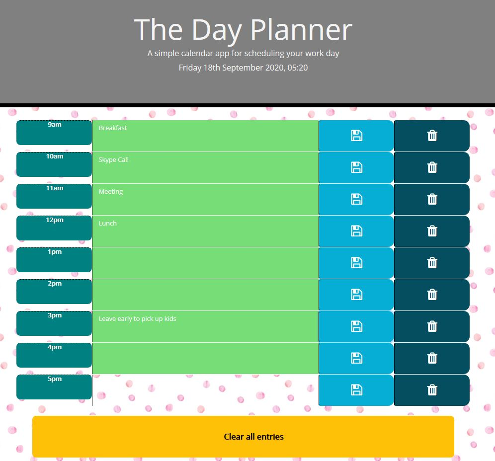
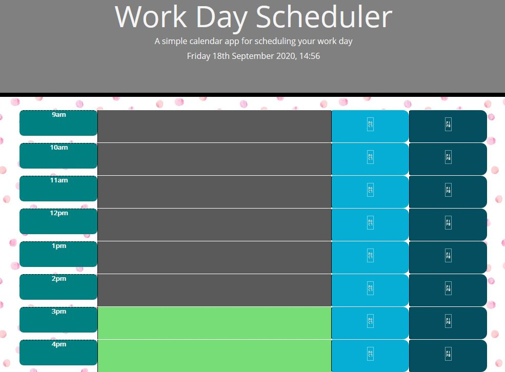

# Third-Party APIs: Day Planner

As I proceed further in into my career as a web developer, I will probably be asked to complete a coding assessment. This project addresses this with a combination of multiple-choice questions and interactive challenges. I've built a timed code quiz with multiple-choice questions. This app will run in the browser and feature dynamically updated HTML and CSS powered by your JavaScript code. It will also feature a clean and polished user interface and be responsive, ensuring that it adapts to multiple screen sizes.

## Contents

- index.html, script.js, style.css, Assets (images and originally provided demo)

## User Story

```
AS AN employee with a busy schedule
I WANT to add important events to a daily planner
SO THAT I can manage my time effectively
```

## Acceptance Criteria

```
GIVEN I am using a daily planner to create a schedule
WHEN I open the planner
THEN the current day is displayed at the top of the calendar
WHEN I scroll down
THEN I am presented with timeblocks for standard business hours
WHEN I view the timeblocks for that day
THEN each timeblock is color coded to indicate whether it is in the past, present, or future
WHEN I click into a timeblock
THEN I can enter an event
WHEN I click the save button for that timeblock
THEN the text for that event is saved in local storage
WHEN I refresh the page
THEN the saved events persist
```

#### Deployed application

Link: https://agr2020xman.github.io/Day-Planner/

### Code

Some static modal elements are stored in the HTML. Meanwhile JS is dynamically using moment.js to update time, and compare these values against each scheduled block. The colour changes to reflect where you are in the day. You can save to local storage to come back to your planner later. You may also clear the events immediately.

#### Sample of deployed application

_The planner with stored data_


_The planner changes colour based on the time_


### Authors

- Some scaffold HTML provided by Trilogy
- Code by \_Andr&eacute; Grech - 18/9/2020
- CSS is a mixture of custom styles and Bootstrap presets to assist in responsiveness

---

© 2019 Trilogy Education Services, a 2U, Inc. brand. All Rights Reserved.
